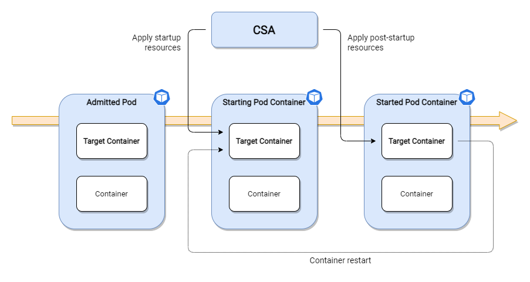

# container-startup-autoscaler 🚀
container-startup-autoscaler (CSA) is a Kubernetes [controller](https://kubernetes.io/docs/concepts/architecture/controller/)
that modifies the CPU and/or memory resources of containers depending on whether they're starting up, according to the
startup/post-startup settings you supply. CSA works at the pod level and is agnostic to how the pod is managed; it
works with deployments, statefulsets, daemonsets and other workload management APIs.



CSA is implemented using [controller-runtime](https://github.com/kubernetes-sigs/controller-runtime).

CSA is built around Kube's [In-place Update of Pod Resources](https://github.com/kubernetes/enhancements/tree/master/keps/sig-node/1287-in-place-update-pod-resources)
feature, which is currently in alpha state as of Kubernetes 1.33 (TODO(wt) is it?) and therefore requires the `InPlacePodVerticalScaling`
feature gate to be enabled. Beta/stable targets are indicated [here](https://github.com/kubernetes/enhancements/issues/1287).
The feature implementation (along with the corresponding implementation of CSA) is likely to change until it reaches
stable status. See [CHANGELOG.md](CHANGELOG.md) for details of CSA versions and Kubernetes version compatibility.

⚠️ This controller should currently only be used for preview purposes on [local](#running-locally) or otherwise
non-production Kubernetes clusters.

## Navigation
<!-- TOC -->
* [container-startup-autoscaler 🚀](#container-startup-autoscaler-)
  * [Navigation](#navigation)
  * [Demo Video](#demo-video)
  * [Docker Images](#docker-images)
  * [Helm Chart](#helm-chart)
  * [Motivation](#motivation)
    * [Employ Burstable QoS](#employ-burstable-qos)
    * [Employ Guaranteed QoS (1)](#employ-guaranteed-qos-1)
    * [Employ Guaranteed QoS (2)](#employ-guaranteed-qos-2)
  * [How it Works](#how-it-works)
  * [Limitations](#limitations)
  * [Restrictions](#restrictions)
  * [Scale Configuration](#scale-configuration)
    * [Labels](#labels)
    * [Annotations](#annotations)
  * [Probes](#probes)
  * [Status](#status)
  * [Events](#events)
    * [Normal Events](#normal-events)
    * [Warning Events](#warning-events)
  * [Logging](#logging)
  * [Metrics](#metrics)
    * [Reconciler](#reconciler)
    * [Scale](#scale)
    * [Kube API Retry](#kube-api-retry)
    * [Informer Cache](#informer-cache)
  * [Retry](#retry)
    * [Kube API](#kube-api)
  * [Informer Cache Sync](#informer-cache-sync)
  * [Encountering Unknown Resources](#encountering-unknown-resources)
  * [CSA Configuration](#csa-configuration)
    * [Controller](#controller)
    * [Retry](#retry-1)
    * [Log](#log)
  * [Pod Admission Considerations](#pod-admission-considerations)
  * [Container Scaling Considerations](#container-scaling-considerations)
  * [Best Practices](#best-practices)
  * [Tests](#tests)
    * [Unit](#unit)
    * [Integration](#integration)
  * [Running Locally](#running-locally)
    * [Cluster/CSA Installation](#clustercsa-installation)
    * [Tailing CSA Logs](#tailing-csa-logs)
    * [Getting CSA Metrics](#getting-csa-metrics)
    * [Watching CSA Status and Enacted Container Resources](#watching-csa-status-and-enacted-container-resources)
    * [(Re)installing echo-service](#reinstalling-echo-service)
    * [Causing an echo-server Container Restart](#causing-an-echo-server-container-restart)
    * [Deleting echo-service](#deleting-echo-service)
    * [Cluster/CSA Uninstallation](#clustercsa-uninstallation)
    * [Stuff to Try](#stuff-to-try)
<!-- TOC -->

## Demo Video
A [local sandbox](#running-locally) is provided for previewing CSA - this video shows fundamental CSA operation using
the sandbox scripts:

https://github.com/ExpediaGroup/container-startup-autoscaler/assets/76996781/fcea0175-4f09-43d3-9bad-de5aed8806f2

## Docker Images
Versioned multi-arch Docker images are available via [Docker Hub](https://hub.docker.com/r/expediagroup/container-startup-autoscaler/tags).

## Helm Chart
A CSA Helm chart is available - please see its [README.md](charts/container-startup-autoscaler/README.md) for more
information.

## Motivation
The release of Kubernetes [1.27.0](https://github.com/kubernetes/kubernetes/blob/master/CHANGELOG/CHANGELOG-1.27.md) 
introduced a new, long-awaited alpha feature:
[In-place Update of Pod Resources](https://github.com/kubernetes/enhancements/tree/master/keps/sig-node/1287-in-place-update-pod-resources).
This feature allows pod container resources (`requests` and `limits`) to be updated in-place, **without the need to
restart the pod**. Prior to this, any changes made to container resources required a pod restart to apply.

A historical concern of running workloads within Kubernetes is how to tune container resources for workloads that have
very different resource utilization characteristics during two core phases: startup and post-startup. Given the previous
lack of ability to change container resources in-place, there was generally a tradeoff for startup-heavy workloads
between obtaining good (and consistent) startup times and overall resource wastage, post-startup:

### Employ Burstable QoS
Set `limits` greater than `requests` in the hope that resources beyond `requests` are actually scavengeable during
startup.

- Startup time is unpredictable since it's dependent on cluster node loading conditions.
- Post-startup performance may also be unpredictable as additional scavengeable resources are volatile in nature
  (particularly with cluster consolidation mechanisms).

### Employ Guaranteed QoS (1)
Set `limits` the same as `requests`, with startup time as the primary factor in determining the value.

- Startup time and post-startup performance is predictable but wastage may occur, particularly if the pod replica count
  is generally more than it needs to be.

### Employ Guaranteed QoS (2)
Set `limits` the same as `requests`, with normal workload servicing performance as the primary factor in determining
the value.

- Post-startup performance is predictable and acceptable, but startup time is slower - this negatively affects
  desirable operational characteristics such as by elongating deployment durations and horizontal scaling reaction
  times.

---

The core motivation of CSA is to leverage the new `In-place Update of Pod Resources` Kube feature to provide workload
owners with the ability to configure container resources for startup (in a guaranteed fashion) separately from normal
post-startup workload resources. In doing so, the tradeoffs listed above are eliminated and the foundations are laid
for:

- Reducing resource wastage by facilitating separate settings for two fundamental workload phases.
- Faster and more predictable workload startup times, promoting desirable operational characteristics.

## How it Works
CSA is able to target a single non-init/ephemeral container within a pod. Configuration such as the target container
name and desired startup/post-startup resource settings are contained within a number of pod annotations.  

CSA watches for changes in pods that are marked as eligible for scaling (via a label). Upon processing an eligible
pod's changes, CSA examines the current state of the target container and takes one of several actions based on that
state:

- Startup resource settings are _commanded_ (the target container currently has its post-startup settings applied and
  isn't started).
- Post-startup resource settings are _commanded_ (the target container currently has its startup settings applied and is
  started).
- The status of a previously commanded scale is determined and appropriately reported upon. If the commanded scale was
  successful, the scale is considered to be _enacted_.

CSA will react when the target container is initially created (by its pod) and if Kube restarts the target container.

CSA will not perform any scaling action if it doesn't need to - for example, if the target container repeatedly fails
to start prior to it becoming ready (with Kube reacting with restarts in a `CrashLoopBackOff` manner), CSA will only
apply startup resources once.

CSA generates metrics and pod Kube events, along with a detailed status that's included within an annotation of the
scaled pod.

## Limitations
The following limitations are currently in place:

- Regardless of which resources are configured to scale (CPU and/or memory), all originally admitted target container
  resources must be guaranteed (`requests` == `limits`) because:
  - CSA only allows guaranteed resources for its startup settings.
  - The `In-place Update of Pod Resources` feature [does not currently allow](https://github.com/kubernetes/enhancements/tree/master/keps/sig-node/1287-in-place-update-pod-resources#qos-class)
    changing pod QoS class.
- Post-startup resources must also currently be guaranteed (`requests` == `limits`) to avoid changing QoS class.
- Failed target container scales are not re-attempted.

## Restrictions
The following restrictions are currently in place and enforced where applicable:

- Only a single container of a pod can be targeted for scaling.
- The target pod must not be controlled by a [VPA](https://github.com/kubernetes/autoscaler/tree/master/vertical-pod-autoscaler).
- For each configured scaling resource (cpu and/or memory), the target container post-startup `requests` must be lower
  than startup resources.
- The target container must specify `requests` for both CPU and memory.
- The target container must specify the `NotRequired` resize policy for both CPU and memory.
- The target container must specify a startup or readiness probe (or both).

## Scale Configuration
### Labels
The following labels must be present in the pod that includes your target container:

| Name                           |  Value   | Description                                                                  |
|--------------------------------|----------|------------------------------------------------------------------------------|
| `csa.expediagroup.com/enabled` | `"true"` | Indicates a container in the pod is eligible for scaling - must be `"true"`. |

### Annotations
The following annotation must always be present in the pod that includes your target container:

| Name                                                | Example Value   | Description                                               |
|-----------------------------------------------------|-----------------|-----------------------------------------------------------|
| `csa.expediagroup.com/target-container-name`        | `"mycontainer"` | The name of the container to target.                      |

To enable CPU scaling, all the following annotations must be present:

| Name                                                | Example Value   | Description                                               |
|-----------------------------------------------------|-----------------|-----------------------------------------------------------|
| `csa.expediagroup.com/cpu-startup`                  | `"500m"`*       | Startup CPU (applied to both `requests` and `limits`).    |
| `csa.expediagroup.com/cpu-post-startup-requests`    | `"250m"`*       | Post-startup CPU `requests`.                              |
| `csa.expediagroup.com/cpu-post-startup-limits`      | `"250m"`*       | Post-startup CPU `limits`.                                |

To enable memory scaling, all the following annotations must be present:

| Name                                                | Example Value   | Description                                               |
|-----------------------------------------------------|-----------------|-----------------------------------------------------------|
| `csa.expediagroup.com/memory-startup`               | `"500M"`*       | Startup memory (applied to both `requests` and `limits`). |
| `csa.expediagroup.com/memory-post-startup-requests` | `"250M"`*       | Post-startup memory `requests`.                           |
| `csa.expediagroup.com/memory-post-startup-limits`   | `"250M"`*       | Post-startup memory `limits`.                             |

At least one of CPU or memory scaling must be configured.

&ast; Any CPU/memory form listed [here](https://kubernetes.io/docs/concepts/configuration/manage-resources-containers/#resource-units-in-kubernetes)
can be used. 

## Probes
CSA needs to know when the target container is starting up and therefore requires you to specify an appropriately
configured startup or readiness probe (or both). 

If the target container specifies a startup probe, CSA always uses Kube's `started` signal of the container's status to
determine whether the container is started. Otherwise, if only a readiness probe is specified, CSA primarily uses the
`ready` signal of the container's status to determine whether the container is started.

**It's preferable to have a startup probe defined** since this unambiguously indicates whether a container is started 
whereas only a readiness probe may indicate other conditions that will cause unnecessary scaling (e.g. the readiness
probe transiently failing post-startup).

---

Kube's container status `started` and `ready` signal behavior is as follows:

When only a startup probe is present:
- `started` is `false` when the container is (re)started and `true` when the startup probe succeeds.
- `ready` is `false` when the container is (re)started and `true` when `started` is `true`.

When only a readiness probe is present:
- `started` is `false` when the container is (re)started and `true` when the container is running and has passed the
  `postStart` lifecycle hook.
- `ready` is `false` when container is (re)started and `true` when the readiness probe succeeds.

When both startup and readiness probes are present:
- `started` is `false` when container is (re)started and `true` when the startup probe succeeds.
- `ready` is `false` when container is (re)started and `true` when the readiness probe succeeds.

## Status
CSA reports its status in JSON via the `csa.expediagroup.com/status` annotation. You can retrieve and format the status
using `kubectl` and `jq` as follows:

```
kubectl get pod <name> -n <namespace> -o=jsonpath='{.items[0].metadata.annotations.csa\.expediagroup\.com\/status}' | jq
```

Example output:

```json
{
  "status": "Post-startup resources enacted",
  "states": {
    "startupProbe": "true",
    "readinessProbe": "true",
    "container": "running",
    "started": "true",
    "ready": "false",
    "resources": "poststartup",
    "statusResources": "containerresourcesmatch"
  },
  "scale": {
    "enabledForResources": [
      "cpu",
      "memory"
    ],
    "lastCommanded": "2023-09-14T08:18:44.174+0000",
    "lastEnacted": "2023-09-14T08:18:45.382+0000",
    "lastFailed": ""
  },
  "lastUpdated": "2023-09-14T08:18:45+0000"
}
```

Explanation of status items:

| Item          | Sub-Item              | Description                                                                                                |
|---------------|-----------------------|------------------------------------------------------------------------------------------------------------|
| `status`      | -                     | Human-readable status. Any validation errors are indicated here.                                           |
| `states`      | -                     | The states of the target container.                                                                        |
| `states`      | `startupProbe`        | Whether a startup probe exists.                                                                            |
| `states`      | `readinessProbe`      | Whether a readiness probe exists.                                                                          |
| `states`      | `container`           | The container status e.g. `waiting`, `running`.                                                            |
| `states`      | `started`             | Whether the container is signalled as started by Kube.                                                     |
| `states`      | `ready`               | Whether the container is signalled as ready by Kube.                                                       |
| `states`      | `resources`           | The type of resources (startup/post-startup) that are currently applied (but not necessarily enacted).     |
| `states`      | `statusResources`     | How the reported current enacted resources relate to container resources.                                  |
| `scale`       | -                     | Information around scaling activity.                                                                       |
| `scale`       | `enabledForResources` | A list of resources that are enabled for scaling (determined by supplied pod [annotations](#annotations)). |
| `scale`       | `lastCommanded`       | The last time a scale was commanded (UTC).                                                                 |
| `scale`       | `lastEnacted`         | The last time a scale was enacted (UTC; empty if failed).                                                  |
| `scale`       | `lastFailed`          | The last time a scale failed (UTC; empty if enacted).                                                      |
| `lastUpdated` | -                     | The last time this status was updated.                                                                     |

## Events
The following Kube events for the pod that houses the target container are generated:

### Normal Events
| Trigger                               | Reason    |
|---------------------------------------|-----------|
| Startup resources are commanded.      | `Scaling` |
| Startup resources are enacted.        | `Scaling` |
| Post-startup resources are commanded. | `Scaling` |
| Post-startup resources are enacted.   | `Scaling` |

### Warning Events
| Trigger                                           | Reason       |
|---------------------------------------------------|--------------|
| Validation failure.                               | `Validation` |
| Failed to scale commanded startup resources.      | `Scaling`    |
| Failed to scale commanded post-startup resources. | `Scaling`    |

## Logging
CSA uses the [logr](https://github.com/go-logr/logr) API with [zerologr](https://github.com/go-logr/zerologr) to log
JSON-based `error`-, `info`-, `debug`- and `trace`-level messages.

When [configuring](#csa-configuration) verbosity, `info`-level messages have a verbosity (`v`) of 0,
`debug`-level messages have a `v` of 1, and `debug`-level messages have a `v` of 2 - this is mapped via zerologr.
Regardless of configured logging verbosity, `error`-level messages are always emitted. 

Example `info`-level log:

```json
{
	"level": "info",
	"controller": "csa",
	"namespace": "echoserver",
	"name": "echoserver-5f65d8f65d-mvqt8",
	"reconcileID": "6157dd49-7aa9-4cac-bbaf-a739fa48cc61",
	"targetname": "echoserver",
	"targetstates": {
		"startupProbe": "true",
		"readinessProbe": "true",
		"container": "running",
		"started": "true",
		"ready": "false",
		"resources": "poststartup",
		"statusResources": "containerresourcesmatch"
	},
	"caller": "container-startup-autoscaler/internal/pod/targetcontaineraction.go:472",
	"time": 1694681974425,
	"message": "post-startup resources enacted"
}
```

Each message includes a number of keys that originate from controller-runtime and zerologr. CSA-added values include:
- `targetname`: the name of the container to target.
- `targetstates`: the states of the target container, per [status](#status).

Regardless of configured logging verbosity, `error`-level messages are always displayed.

## Metrics
Additional CSA-specific metrics are registered to the Prometheus registry exposed by controller-runtime and exposed
on port 8080 and path `/metrics` e.g. `http://localhost:8080/metrics`. CSA metrics are not pre-initialized with `0`
values.
 
### Reconciler
Prefixed with `csa_reconciler_`:

| Metric Name                  | Type    | Labels    | Description                                                                                                          |
|------------------------------|---------|-----------|----------------------------------------------------------------------------------------------------------------------|
| `skipped_only_status_change` | Counter | None      | Number of reconciles that were skipped because only the scaler controller status changed.                            |
| `existing_in_progress`       | Counter | None      | Number of attempted reconciles where one was already in progress for the same namespace/name (results in a requeue). |
| `failure`                    | Counter | `reason`* | Number of reconciles where there was a failure.                                                                      |

&ast; `reason` values:

| Reason                 | Description                                                   |
|------------------------|---------------------------------------------------------------|
| `unable_to_get_pod`    | Failure to get the pod (results in a requeue).                |
| `pod_does_not_exist`   | Pod was found not to exist (results in failure).              |
| `configuration`        | Failure to configure (results in failure).                    |
| `validation`           | Failure to validate (results in failure).                     |
| `states_determination` | Failure to determine states (results in failure).             |
| `states_action`        | Failure to action the determined states (results in failure). |

### Scale
Prefixed with `csa_scale_`:

| Metric Name                   | Type      | Labels                 | Description                                                                                                   |
|-------------------------------|-----------|------------------------|---------------------------------------------------------------------------------------------------------------|
| `failure`                     | Counter   | `direction`, `reason`  | Number of scale failures.                                                                                     |
| `commanded_unknown_resources` | Counter   | None                   | Number of scales commanded upon encountering unknown resources (see [here](#encountering-unknown-resources)). |
| `duration_seconds`            | Histogram | `direction`, `outcome` | Scale duration (from commanded to enacted).                                                                   |

Labels:
- `direction`: the direction of the scale - `up`/`down`.
- `reason`: the reason why the scale failed.
- `outcome`: the outcome of the scale - `success`/`failure`.

### Kube API Retry
Prefixed with `csa_retrykubeapi_`:

| Metric Name | Type    | Labels   | Description                 |
|-------------|---------|----------|-----------------------------|
| `retry`     | Counter | `reason` | Number of Kube API retries. |

Labels:
- `reason`: the Kube API response that caused a retry to occur.

See [below](#retry) for more information on retries.

### Informer Cache
Prefixed with `csa_informercache_`:

| Metric Name    | Type      | Labels | Description                                                                                                                                 |
|----------------|-----------|--------|---------------------------------------------------------------------------------------------------------------------------------------------|
| `sync_poll`    | Histogram | None   | Number of informer cache sync polls after a pod mutation was performed via the Kube API.                                                    |
| `sync_timeout` | Counter   | None   | Number of informer cache sync timeouts after a pod mutation was performed via the Kube API (may result in inconsistent CSA status updates). |

See [below](#informer-cache-sync) for more information on informer cache syncs.

## Retry
### Kube API
Unless Kube API reports that a pod is not found upon trying to retrieve it, all Kube API interactions are subject to
retry according to CSA retry [configuration](#csa-configuration).

CSA handles situations where Kube API reports a conflict upon a pod update. In this case, CSA retrieves the latest
version of the pod and reapplies the update, before trying again (subject to retry configuration).   

## Informer Cache Sync
The CSA [status](#status) includes timestamps that CSA uses itself internally, such as for calculating scale durations.
When status is updated, CSA waits for the updated pod to be reflected in the informer cache prior to finishing
the reconcile to ensure following reconciles have the latest status available to work upon. Without this mechanism, the
rapid pace of pod updates during resizes can prevent subsequent reconciles from retrieving the latest status. This
occurs because the informer may not have cached the updated pod in time, resulting in inaccurate status updates.

The CSA reconciler doesn't allow concurrent reconciles for same pod so subsequent reconciles will not start until this
wait described above has completed.

The informer cache metrics described [above](#informer-cache) provide insight into how quickly the informer cache is
updated (synced) after status is updated, and whether any timeouts occur:

- `patch_sync_poll`: the number of cache polls that were required to confirm the cache was populated with the updated
  pod. The cache is polled periodically per the `waitForCacheUpdatePollMillis` configuration [here](internal/kube/podhelper.go).
  Higher values indicate longer cache sync times.
- `patch_sync_timeout`: the number of times the cache sync timed out per the`waitForCacheUpdateTimeoutMillis`
  configuration [here](internal/kube/podhelper.go). Timeouts do not result in an error or termination of the reconcile,
  but may result in inconsistent CSA status updates.  

## Encountering Unknown Resources
By default, CSA will yield an error if it encounters resources applied to a target container that it doesn't recognize
i.e. resources other than those specified within the pod startup or post-startup resource [annotations](#annotations). This may
occur if resources are updated by an actor other than CSA. To allow corrective scaling upon encountering such a
condition, set the `--scale-when-unknown-resources` [configuration flag](#controller) to `true`.

When enabled and upon encountering such conditions, CSA will:
- Command startup/post-startup resources according to whether the container is started.
- Append the Kube startup/post-startup resources commanded [event](#normal-events) reason and [log message](#logging)
  with `(unknown resources applied)`
- Increment the `commanded_unknown_resources` [metric](#scale).
- Treat enacted startup resources as directionally scaled `down` within the `failure` and `duration_seconds` (as
  applicable) [metrics](#scale).
- Treat enacted post-startup resources as directionally scaled `up` within the `failure` and `duration_seconds` (as
  applicable) [metrics](#scale).

## CSA Configuration
CSA uses the [Cobra](https://github.com/spf13/cobra) CLI library and exposes a number of optional configuration flags.
All configuration flags are always logged upon CSA start.

### Controller
| Flag                                   | Type    | Default Value | Description                                                                                                  |
|----------------------------------------|---------|---------------|--------------------------------------------------------------------------------------------------------------|
| `--kubeconfig`                         | String  | -             | Absolute path to the cluster kubeconfig file (uses in-cluster configuration if not supplied).                |
| `--leader-election-enabled`            | Boolean | `true`        | Whether to enable leader election.                                                                           |
| `--leader-election-resource-namespace` | String  | -             | The namespace to create resources in if leader election is enabled (uses current namespace if not supplied). |
| `--cache-sync-period-mins`             | Integer | `60`          | How frequently the informer should re-sync.                                                                  |
| `--graceful-shutdown-timeout-secs`     | Integer | `10`          | How long to allow busy workers to complete upon shutdown.                                                    |
| `--requeue-duration-secs`              | Integer | `1`           | How long to wait before requeuing a reconcile.                                                               |
| `--max-concurrent-reconciles`          | Integer | `10`          | The maximum number of concurrent reconciles.                                                                 |
| `--scale-when-unknown-resources`       | Boolean | `false`       | Whether to scale when [unknown resources](#encountering-unknown-resources) are encountered.                  |

### Retry
| Flag                               | Type    | Default Value | Description                                                    |
|------------------------------------|---------|---------------|----------------------------------------------------------------|
| `--standard-retry-attempts`        | Integer | `3`           | The maximum number of attempts for a standard [retry](#retry). |
| `--standard-retry-delay-secs`      | Integer | `1`           | The number of seconds to wait between standard retry attempts. |

### Log
| Flag               | Type    | Default Value | Description                                                                        |
|--------------------|---------|---------------|------------------------------------------------------------------------------------|
| `--log-v`          | Integer | `0`           | [Log](#logging) verbosity level (0: info, 1: debug, 2: trace) - 2 used if invalid. |
| `--log-add-caller` | Boolean | `false`       | Whether to include the caller within logging output.                               |

## Pod Admission Considerations
Upon pod cluster admission, CSA will attempt to upscale the target container to its startup configuration. Upscaling 
success depends on node loading conditions - it's therefore possible that the scale is delayed or fails altogether,
particularly if a cluster consolidation mechanism is employed.

In order to mitigate the effects of initial startup upscaling, it's recommended to admit pods with the target container
startup configuration already applied - CSA will not need to initially upscale in this case. Once startup has
completed, the subsequent downscale to apply post-startup resources is significantly less likely to fail since it's not
subject to node loading conditions. In addition, any failure mode results in overall resource over-provisioning rather
than startup under-provisioning.

It's important to note that in either case, CSA will need to upscale if Kube restarts the target container.

```yaml
apiVersion: apps/v1
kind: Deployment
spec:
  template:
    metadata:
      labels:
        csa.expediagroup.com/enabled: "true"
      annotations:
        csa.expediagroup.com/target-container-name: target-container
        csa.expediagroup.com/cpu-startup: 500m
        csa.expediagroup.com/cpu-post-startup-requests: 100m
        csa.expediagroup.com/cpu-post-startup-limits: 100m
        csa.expediagroup.com/memory-startup: 500M
        csa.expediagroup.com/memory-post-startup-requests: 100M
        csa.expediagroup.com/memory-post-startup-limits: 100M
    spec:
      containers:
      - name: target-container
        resources:
          limits:
            cpu: 500m    # Admitted with csa.expediagroup.com/cpu-startup value 
            memory: 500M # Admitted with csa.expediagroup.com/memory-startup value
          requests:
            cpu: 500m    # Admitted with csa.expediagroup.com/cpu-startup value
            memory: 500M # Admitted with csa.expediagroup.com/memory-startup value
```

## Container Scaling Considerations
Please consider carefully whether it's appropriate to scale memory during execution of your container. Memory
management differs between runtimes, and it's not necessarily possible to change any runtime configuration (e.g.
limits) set at the point of admission without restarting the container. Some runtimes may also default memory management
settings based on available resources, which may no longer be optimal when memory is scaled. 

In addition, some languages/frameworks may default configuration of concurrency mechanisms (e.g. thread pools) based
on available CPU resources - this should be taken into consideration if applicable. 

## Best Practices
- Define a [startup probe](#probes) since this unambiguously indicates whether a container is started.
- [Admit pods](#pod-admission-considerations) with target container startup resources specified.
- Try to minimize restarts of target containers for causes within your control.
- Try to minimize the startup time of your workload through profiling and optimization where possible.
- Try to minimize the difference between startup resources and post-startup resources - in general, the bigger the
  difference, the less likely an upscale is to succeed (particularly when a cluster consolidation mechanism is
  employed).

## Tests
### Unit
Unit tests can be run by executing `make test-run-unit` from the root directory.

### Integration
Integration tests can be run by executing `make test-run-int` or `make test-run-int-verbose` (verbose logging) from the
root directory. Please ensure you're using a version of Go that's at least that of the version that's indicated at the
top of [go.mod](go.mod).

Integration tests are implemented as Go tests and located in `test/integration`. During initialization of the tests, a
[kind](https://kind.sigs.k8s.io/) cluster is created (with a specific name); CSA is built via Docker and run via
[Helm](#helm-chart). Tools are not bundled with the tests, so you must have the following installed locally:

- Docker
- Helm
- kind (at least 0.24.0)
- kubectl

The integration tests use [echo-server](https://github.com/Ealenn/Echo-Server) for containers. Note: the very first
execution might take some time to complete.

A number of environment variable-based configuration items are available:

| Name                     | Default | Description                                                                                                                          |
|--------------------------|---------|--------------------------------------------------------------------------------------------------------------------------------------|
| `KUBE_VERSION`           | -       | The _major.minor_ version of Kube to run tests against e.g. `1.33`.                                                                  |
| `MAX_PARALLELISM`        | `5`     | The maximum number of tests that can run in parallel.                                                                                |
| `EXTRA_CA_CERT_PATH`     | -       | See below.                                                                                                                           |
| `REUSE_CLUSTER`          | `false` | Whether to reuse an existing CSA kind cluster (if it already exists). `KUBE_VERSION` has no effect if an existing cluster is reused. |
| `INSTALL_METRICS_SERVER` | `false` | Whether to install metrics-server.                                                                                                   |
| `KEEP_CSA`               | `false` | Whether to keep the CSA installation after tests finish.                                                                             |
| `KEEP_CLUSTER`           | `false` | Whether to keep the CSA kind cluster after tests finish.                                                                             |
| `DELETE_NS_AFTER_TEST`   | `true`  | Whether to delete namespaces created by tests after they conclude.                                                                   |

Integration tests are executed in parallel due to their long-running nature. Each test operates within a separate Kube
namespace (but using the same single CSA installation). If local resources are limited, reduce `MAX_PARALLELISM`
accordingly and ensure `DELETE_NS_AFTER_TEST` is `true`. Each test typically spins up 2 pods, each with 2 containers;
see source for resource allocations.

`EXTRA_CA_CERT_PATH` is an optional configuration item that allows registration of an additional CA certificate
(or chain) when building the kind node image. This will be required if a technology that intercepts encrypted network
traffic via insertion of its own CA is being used. The path must be absolute and reference a PEM-formatted file. 

## Running Locally
A number of Bash scripts are supplied in the `scripts/sandbox` directory that allow you to try out CSA using
[echo-server](https://github.com/Ealenn/Echo-Server). The scripts are similar in nature to the setup/teardown work 
performed in the [integration tests](#integration) and have the same local tool requirements. Please ensure you're
using a version of Go that's at least that of the version that's indicated at the top of [go.mod](go.mod). Note: the
kind cluster created by the scripts is named differently to the [integration tests](#integration) such that both can
exist in parallel, if desired.

### Cluster/CSA Installation
Executing `csa-install.sh`:
- Removes any pre-existing CSA kind cluster.
- Installs a CSA kind cluster with the latest version of Kubernetes [certified as compatible with CSA](CHANGELOG.md).
- Creates a new, separate CSA kind cluster kubeconfig file under `$HOME/.kube/`.
- Pulls metrics-server, loads the image into the CSA kind cluster and installs.
- Pulls echo-server and loads the image into the CSA kind cluster.
- Builds CSA and loads the image into the CSA kind cluster.
- Runs CSA via the [Helm chart](#helm-chart).
  - [Leader election](#controller) is enabled; 2 pods are created.
  - [Log verbosity level](#log) is `2` (trace).

Note:
- To register an additional CA certificate (or chain) when building the kind node image as described
  [above](#integration), pass `--extra-ca-cert-path=/path/to/ca.pem` when executing the script.
- The very first execution might take some time to complete.

### Tailing CSA Logs
Executing `csa-tail-logs.sh` tails logs from the current CSA leader pod.

### Getting CSA Metrics
Executing `csa-get-metrics.sh` gets [metrics](#metrics) from the current CSA leader pod.

### Watching CSA Status and Enacted Container Resources
Executing `echo-watch.sh` `watch`es the CSA [status](#status) for the pod created below along with the target
container's enacted resources.

### (Re)installing echo-service
Execute `echo-reinstall.sh` to (re)install echo-service with a specific configuration contained within the `echo`
directory structure.

Admit with post-startup resources ([initial upscale required](#pod-admission-considerations)):

| Command                                                                               | Scale Configuration | Probes                |
|---------------------------------------------------------------------------------------|---------------------|-----------------------|
| `./echo-reinstall.sh echo/post-startup-resources/cpu-and-memory/startup-probe.yaml`   | CPU and memory      | Startup               |
| `./echo-reinstall.sh echo/post-startup-resources/cpu-and-memory/readiness-probe.yaml` | CPU and memory      | Readiness             |
| `./echo-reinstall.sh echo/post-startup-resources/cpu-and-memory/both-probes.yaml`     | CPU and memory      | Startup and readiness |
| `./echo-reinstall.sh echo/post-startup-resources/cpu-only/startup-probe.yaml`         | CPU only            | Startup               |
| `./echo-reinstall.sh echo/post-startup-resources/cpu-only/readiness-probe.yaml`       | CPU only            | Readiness             |
| `./echo-reinstall.sh echo/post-startup-resources/cpu-only/both-probes.yaml`           | CPU only            | Startup and readiness |
| `./echo-reinstall.sh echo/post-startup-resources/memory-only/startup-probe.yaml`      | Memory only         | Startup               |
| `./echo-reinstall.sh echo/post-startup-resources/memory-only/readiness-probe.yaml`    | Memory only         | Readiness             |
| `./echo-reinstall.sh echo/post-startup-resources/memory-only/both-probes.yaml`        | Memory only         | Startup and readiness |

Admit with startup resources ([initial upscale not required](#pod-admission-considerations)):

| Command                                                                          | Scale Configuration | Probes                |
|----------------------------------------------------------------------------------|---------------------|-----------------------|
| `./echo-reinstall.sh echo/startup-resources/cpu-and-memory/startup-probe.yaml`   | CPU and memory      | Startup               |
| `./echo-reinstall.sh echo/startup-resources/cpu-and-memory/readiness-probe.yaml` | CPU and memory      | Readiness             |
| `./echo-reinstall.sh echo/startup-resources/cpu-and-memory/both-probes.yaml`     | CPU and memory      | Startup and readiness |
| `./echo-reinstall.sh echo/startup-resources/cpu-only/startup-probe.yaml`         | CPU only            | Startup               |
| `./echo-reinstall.sh echo/startup-resources/cpu-only/readiness-probe.yaml`       | CPU only            | Readiness             |
| `./echo-reinstall.sh echo/startup-resources/cpu-only/both-probes.yaml`           | CPU only            | Startup and readiness |
| `./echo-reinstall.sh echo/startup-resources/memory-only/startup-probe.yaml`      | Memory only         | Startup               |
| `./echo-reinstall.sh echo/startup-resources/memory-only/readiness-probe.yaml`    | Memory only         | Readiness             |
| `./echo-reinstall.sh echo/startup-resources/memory-only/both-probes.yaml`        | Memory only         | Startup and readiness |

To simulate workload startup/readiness, `initialDelaySeconds` is set as follows in all configurations:

| Configuration                 | Startup Probe | Readiness Probe |
|-------------------------------|---------------|-----------------|
| `echo/*/startup-probe.yaml`   | `15`          | N/A             |
| `echo/*/readiness-probe.yaml` | N/A           | `15`            |
| `echo/*/both-probes.yaml`     | `15`          | `30`            |

You can also cause a validation failure by executing `echo-reinstall.sh echo/validation-failure/cpu-config.yaml`. This
will yield the `cpu post-startup requests (...) is greater than startup value (...)` status message.

### Causing an echo-server Container Restart
Execute `echo-cause-container-restart.sh` to cause the echo-service container to restart. Note: `CrashLoopBackoff`
may be triggered upon executing this multiple times in succession.

### Deleting echo-service
Executing `echo-delete.sh` deletes the echo-server namespace (including pod).

### Cluster/CSA Uninstallation
Executing `csa-uninstall.sh` uninstalls the CSA kind cluster.

### Stuff to Try
First [establish a watch on CSA status and enacted container resources](#watching-csa-status-and-enacted-container-resources)
and optionally [tail CSA logs](#tailing-csa-logs). You may also want to observe [CSA metrics](#getting-csa-metrics).

1. [Install](#reinstalling-echo-service) echo-server with `echo/post-startup-resources/cpu-and-memory/startup-probe.yaml` and watch as
   CSA upscales the container for startup, then downscales once the container is started.
2. Install echo-server with `echo/startup-resources/cpu-and-memory/startup-probe.yaml` and watch as CSA only downscales
   once the container is started - note the CSA `lastCommanded` and `lastEnacted` status is not populated until
   downscale.
3. Repeat 1) and 2) above with a readiness probe only (`echo/*/readiness-probe.yaml`) and watch as CSA only reacts to
   the container's `ready` status i.e. not `started`.
4. Repeat 1) and 2) above with both probes (`echo/*/both-probes.yaml`) and watch as CSA only reacts to the container's
   `started` status i.e. not `ready`.
5. [Cause a container restart](#causing-an-echo-server-container-restart) after post-startup resources are enacted and
   watch as CSA (re)upscales the container for startup, then downscales once the container is started.
6. Cause a container restart repeatedly after startup resources are enacted and watch as CSA doesn't take any action
   until downscaling after the container is started.
7. Install echo-server with `echo/validation-failure/cpu-config.yaml` and observe CSA status when a validation failure
   occurs.
